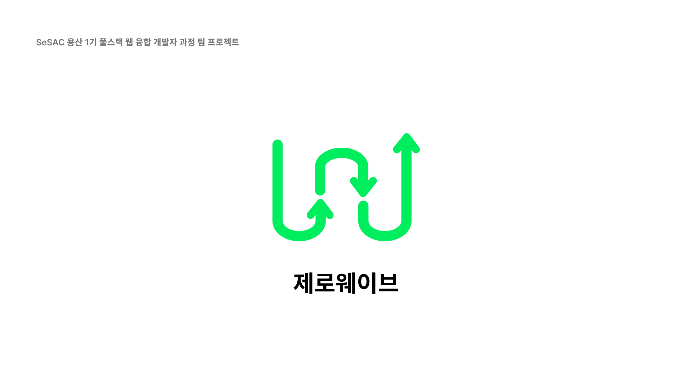

# Zerowave

  

## 프로젝트 소개

일상 속에서 폐기물을 줄일 수 있는 제로웨이스트를 쉽게 실천할 수 있게 도와주는 사이트를 제작하고자 했습니다. 
제로웨이스트 샵의 위치 정보를 제공하고, 집에서 다회용 용기를 가져가 음식을 포장해 일회용품을 줄이는 용기내 챌린지의 유행을 전파합니다

 

### 기간
2022/12/10 ~ 2022/12/29 (총 2주)
 
 

### 기술 스택

| JavaScript | Html/Css |  Node   |  Kakao Map API   |
| :--------: | :--------: | :------: | :-----: |
|   ![js]    |   ![htmlCss]    | ![nodejs] | ![kakao] |

 

## 구현 기능

### 1. 회원가입/로그인
- 기본적인 유저정보를 회원가입을 통해 저장할 수 있습니다.
- 로그인을 하게되면 session에 유저정보를 저장해 로그인 정보가 남아있게 됩니다.
- 로그인 유무에 따라서 네비게이션 바의 구성이 달라집니다.

 

### 2. 제로웨이스트샵 / 용기내 챌린지샵 검색
- 사용자가 지도를 움직여 제로웨이스트샵 및 용기내 챌린지 샵을 조회할 수 있습니다.
- 카카오맵 API를 사용해 포커스된 위치의 위도경도값을 활용해 디비에 저장된 값을 불러옵니다.
- 처음 Map페이지 접속시 제로웨이스트와 용기내 챌린지샵을 모두 보여주고 둘을 구분하기 위해 제로웨이브의 메인컬러로 나눠 UI를 구성했습니다.
- 리스트의 버튼을 통해 제로웨이스트와 용기내 챌릭지샵 버튼의 value를 통해 지도에 보여지는 가게를 필터링했습니다.
- 반응형으로 제작해 모바일 사이즈에서는 버튼으로 리스트를 Map위에 띄웠다가 가렸다가 해서 지도를 편리하게 움직일 수 있습니다.

 

### 3. 제로웨이스트 샵 / 용기내 챌린지샵 직접 추가 
- 사용자가 직접 용기내 챌린지샵을 추가할 수 있습니다.
- 카카오 맵 API를 통해 가게를 검색하고 지도에서 클릭했을 때 이미 등록된 가게가 아니라면 +버튼이 뜨게 만들었습니다.
- +버튼 클릭시 모달창을 통해 사용자는 제로웨이스트샵과 용기내 챌린지 샵 중 선택할 수 있으며 이때 시각성을 위해 배경색이 어두워집니다. 
- 등록한 가게는 세션에 저장된 유저정보를 통해 디비에서 값을 조회하고, 마이페이지의 내가 등록한 장소에 뿌려주게 됩니다.

 

### 4. 즐겨찾기
- 회원가입한 사용자는 가게를 즐겨찾기 할 수 있습니다.
- 즐겨찾기한 가게는 마이페이지의 즐겨찾기 버튼을 클릭할 시 보여지게 됩니다.
- 제로웨이스트 샵과 용기내챌린지 샵의 구분을 위해 제로웨이스트의 메인컬러로 구분에 시각성을 높였습니다.

 

<!-- Stack Icon Refernces -->

[js]: /Imgs/js.png
[htmlCss]:  /Imgs/html_css_logo.png
[nodejs]:  /Imgs/Node.js_logo.svg.png
[kakao]:  /Imgs/kakaoApi.png
